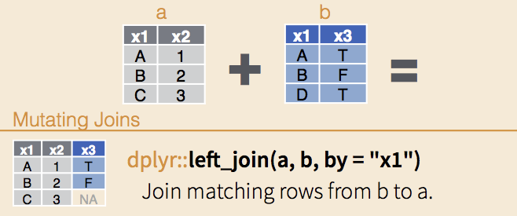

# Week 3 {-}

# Reading, tidying & joining data


This session will focus on reading information into R and 'tidying' it into a form that makes manipulation and plotting as easy as possible.  
The tidyr functions within the eponymous tidyverse are designed to help users to convert data into a 'tidy format'. There are three simple principals for tidy data:  

* each column represents a single measurement type 
<!-- avoid refering to columns as 'variables' given that this term is used interchangeably for R objects -->
* each row represents a single observation
* each cell contains a single value


The context for this session is that your colleague hears that you have successfully completed the first sessions of the WEHI tidyverse R course `r emo::ji('blush')`, and asks you to plot some data for their upcoming lab talk. They send you results from a differential gene expression experiment, and want you to plot the significant genes according to their Gene Ontology (GO) terms.   

They send you four files:  

* **entrez_logFC.xlsx**, a results table containing the entrez gene ID, log2 fold-change (logFC) and adjusted P value for each significant gene (Microsoft Excel format)
* **Hs_entrez_annot.csv**, the gene names and descriptions for each entrez gene ID (comma-separated values)
* **GO_entrez.txt**, the entrez IDs corresponding to different GO terms (space-separated values); and,
* **GO_term_defin.tsv**, a table of descriptions for each GO term (tab-separated values)

To access these files, download and unzip [this folder](https://www.dropbox.com/sh/hihrdes1gom7e9h/AABKerUadszjBANjYXcPaTaVa?dl=0) into your Desktop WEHI_tidyR_course folder.


Feel free to open the text files (.csv ; .txt ; .tsv) in TextEdit or another editor to see the data, but make sure not to make any changes.  

Unfortunately not all of the files come in a tidy form, so we will need to improve them according to the tidy data principals using the functions below, and then join them together to make the final plot.  

First let's create a new .R text file, save as 'Week_3_tidyverse.R' in the WEHI_tidyR_course folder, and load the tidyverse package

```{r, message=FALSE, warning=FALSE}
library(tidyverse)
```

Now we can read the data files into R. 

## Reading in data

### read_excel()

Broadly speaking there are two ways to read an excel file into R.  
<br>
You can click 'Import Dataset' in the Environment tab (top right pane) >> 'From Excel...' >> 'Browse...' >> navigate to your WEHI_tidyR_course folder and select the file 'entrez_logFC.xlsx'.   
In the 'Options' section check 'First row as names', then click 'Import'.  

The excel table is now imported into a variable called 'entrez_logFC' and you will see that code appears in the console similar to this:


```{r, echo=FALSE}
entrez_logFC <- readxl::read_excel('~/Dropbox/R_teaching_materials/WEHI_IntroR_Course/data_files/entrez_logFC.xlsx')
```

```{r, eval=FALSE}

library(readxl)
entrez_logFC <- read_excel("~/Desktop/WEHI_tidyR_course/data_files/entrez_logFC.xlsx")

```


You can copy and paste this code into your R text file so that next time you run your code, the table is imported without you having to go through the point-and-click route.  

The alternative way is to directly type and run the code as it appears above.  

Your colleague has also provide text files in the form of csv (comma-separated values), tsv (tab-separated values), and txt (space-separated values), which require slightly different read functions.

### read_csv()


The read_csv() function from tidyr is used when you select 'Import Dataset' >> 'From text (readr)...' and set the 'Import Options' Delimeter to 'comma'.   
Alternatively you can directly call read_csv() as follows, and assign the output into a new variable 'Hs_entrez_annot'


```{r, eval=FALSE}

Hs_entrez_annot <- read_csv("~/Desktop/WEHI_tidyR_course/data_files/Hs_entrez_annot.csv")

```

```{r, echo=FALSE, message=TRUE, results='markup'}
Hs_entrez_annot <- read_csv("~/Dropbox/R_teaching_materials/WEHI_IntroR_Course/data_files/Hs_entrez_annot.csv")
```

This message indicates the names and type of data that has been assigned for each column. col_double() denotes a type of numeric data.

### read_delim()

For the white space-separated file "GO_entrez.txt" (which is far from tidy), it is best to use a more flexible read function called read_delim(). This function allows us to directly specify the delimiter (i.e., the character used to separate the columns). In this case we will use `delim=' '` to indicate that the columns are separated by a white space, and assign the output into a new variable 'GO_entrez'

```{r, eval=FALSE}
GO_entrez <- read_delim('~/Desktop/WEHI_tidyR_course/data_files/GO_entrez.txt',
                        delim = ' ')
```

```{r, echo=FALSE, message=TRUE, results='markup'}
GO_entrez <- read_delim("~/Dropbox/R_teaching_materials/WEHI_IntroR_Course/data_files/GO_entrez.txt", delim = ' ')
```

We can see that the GO_entrez variable contains two columns, 'rowname' and 'go_entrez'.  

### read_tsv()

Lastly we will read the "GO_term_defin.tsv" which is tab-separated (aka 'tab-delimited'), using read_tsv(). The data will be assigned to a new variable 'GO_terms'

```{r, eval=FALSE }
GO_terms <- read_tsv('~/Desktop/WEHI_tidyR_course/data_files/GO_term_defin.tsv')

```

```{r, eval=TRUE, echo=FALSE, message=TRUE, results='markup'}
GO_terms <- read_tsv('~/Dropbox/R_teaching_materials/WEHI_IntroR_Course/data_files/GO_term_defin.tsv')

```

We see that the new variable contains a dataframe with five columns, all of which are character data.  
Note that this tsv file could also be read in using read_delim(), specifying the tab delimeter as `delim = '\t'`. The .csv file could be read using the same function, with `delim = ','`.

## Reshaping data

Let's have a look at the newly created dataframes. Starting with entrez_logFC

```{r}
entrez_logFC %>% head()
```

This dataframe conforms to the tidy data principals. Each row represents an 'observation' (a different entrez gene ID), and each column represents a different measurement type (log fold-change in RNA abundance, and adjusted p. value). Further, each cell contains a single value.  
This is what we are aiming for with the other data sets.  

Now to check Hs_entrez_annot
```{r}
Hs_entrez_annot %>% head()
```
This is not tidy, because each observation (the entrez_id) is duplicated into 2 rows. The annotation type ('annot_type': symbol or gene name) should ideally be individual columns, containing the correpsonding annotation_text ('annot_text').

### pivot_wider()

To modify this table so that it conforms to the tidy principals, we need to 'reshape' it. We need a function that can convert the labels in the 'annot_type' column into two new column names, and assort the data in 'annot_text' according to their respective new column names.

The function for this job is pivot_wider()


pivot_wider() requires two commands, both of which are column names in the original table.  

`names_from` indicates the column containing the labels which will be come the new column names.  
`values from` indicates the column containing the values that will populate the the new columns.   
To transform the illustrative table above at left (`df_long`) into the result at right, would require:    
`df_long %>% pivot_wider(names_from = V1, values_from = V2)`.  
Note that the 'shape' of the dataframe is being converted from longer (more rows) to wider (more columns).

In our case, to reshape Hs_entrez_annot, we will use the column names annot_type, and annot_text:

```{r}
Hs_entrez_annot %>% pivot_wider(names_from = annot_type, values_from = annot_text)
```
Whereas the original table has 306 rows, the output of pivot_wider() has only 153 rows. This is because the rows are  de-duplicated as the new columns are created.  
Given that the output is in 'tidy' format, we can assign it to a new variable 'Hs_entz_annot_tidy'
```{r}
Hs_entz_annot_tidy <- Hs_entrez_annot %>%
  pivot_wider(names_from = annot_type, 
              values_from = annot_text)

```

Note that because we only have two labels in the annot_type column, we are replacing the existing two columns with only two new columns. As such the shape of the output technically isnt any wider than the input dataframe. However when there are more than two unique labels in the `names_from` column, the output will be wider than the input.


### pivot_longer()

The function that complements pivot_wider() is of course pivot_longer(). This function does not create tidy data, because it duplicates rows. However the 'long format' output from pivot_longer() is often required for ggplot, where each aesthetic or facet category must be a single column of values; and for left_join(), introduced below.  


pivot_longer() takes three commands, specifying

1) a vector of the names of the columns to convert to labels in long form `cols =`,  
2) a name for the new column containing the labels from 1: `names_to =`,  
3) a name for the new column containing the values corresponding to 1: `values_to =`

Note that pivot_wider(), requires the new column names in quotes.

So for the figure above, to convert from the left table (`df_wide`) to the long table at right, would require:
`df_wide %>% pivot_longer(cols = c(X2,X3,X4), names_to = 'V1', values_to = 'V2')`


Let's see how this can be applied to the GO_terms dataframe
```{r}
GO_terms 
```

The BP, CC and MF columns relate to 'Biological Process', 'Cellular Component' and 'Molecular  Function' ontologies within the [Gene Ontology framework](http://geneontology.org/docs/ontology-documentation/). 

We can see there are many NA values in these columns, as each GOID relates to a single type of ontology. That is, if there is text in BP, then CC and MF will be NA values.  
If we consider the text in this table as individual 'values' then the table is technically tidy, but the information is sparsely populated throughout.  

To eliminate the NA values we first use pivot_longer(), with the aim of converting to long format those columns containing ontology descriptions: BP,CC, and MF.  
The new column for labels will be 'ONTOLOGY', and the new column containing the associated text will be 'DESCRIPTION'


```{r}
GO_terms %>% 
  pivot_longer(cols = c(BP,CC,MF),  
               names_to = 'ONTOLOGY',
               values_to = 'DESCRIPTION')

```

Now the data is in long form, with the GOID and DEFINITION columns duplicated. All of the NA values are now in a single column (DESCRIPTION). We can easily filter out these NA values, and assign the new dataframe to a variable 'GO_terms_long'

```{r}

GO_terms_long <- GO_terms %>% 
  pivot_longer(cols      =  c(BP, CC, MF),  
               names_to  = 'ONTOLOGY',
               values_to = 'DESCRIPTION') %>% 
  filter(!is.na(DESCRIPTION))

```

Importantly, in cases where there are 10s of column names to convert to long format, it is simpler to use `cols =` to specify those columns that we _don't_ want to convert, which are usually the left-most columns.  
This is done with the `-` symbol we previously used with select(), and for negative vector sub-setting.  
To achieve the same result as above using this approach:

```{r}
GO_terms_long <- GO_terms %>% 
  pivot_longer(cols      =  -c(GOID, DEFINITION),  
               names_to  = 'ONTOLOGY',
               values_to = 'DESCRIPTION') %>% 
  filter(!is.na(DESCRIPTION))

```
`cols` can also take the other helpers used with select(), such as starts_with(), contains() etc.


## Separating and uniting columns

So far we have reshaped data where the input conforms to the third principal of 'tidiness': each cell contains a single value. When this is not the case, we may need to split values into several columns, using separate(); or combine values into a single column using unite(). 

GO_entrez is certainly the messiest of the datasets we have been provided. Let's take look:


```{r}
GO_entrez %>% head()
```

The dataframe has two columns: 'rownames' which is a meaningless sequence of integers, and 'go_entrez' which appears to contain GO IDs interspersed with underscores, and a long string of comma-separated entrez IDs.

We will need to make several changes to produce a long-format table of GO terms and corresponding entrez IDs in consecutive rows.

First, we should separate the go_entrez column into three, containing the 'GO' prefix, the code, and the string of entrez IDs.

### separate()

The tidyr separate() function takes a column name as the first command, and separates it into a number of new columns (a vector of names of our choosing, in quotes), according to a particular character delimiter, the 'separator' or 'sep'.

The `sep =` command has the same role as `delim =` in read_delim() above.

Let's split the go_entrez column into three new columns named 'prefix','code_only' and 'entrez_multi', according to the underscore `_` character:

```{r}
GO_entrez %>% 
  separate(go_entrez, 
           into = c('prefix','code_only','entrez_multi'),
           sep = '_')
```
Note that the code_only column contains only integers but remains encoded as 'character data'.  

Its possible to allow R to guess the data types for newly created columns by including `convert = TRUE` at the end of the above command.  

Here however we want to preserve the leading 0s in code_only which would be dropped if this column was converted to the numeric data type.  

Let's store the output of separate() as a new variable named 'GO_entrez_sep'

```{r}
GO_entrez_sep <- GO_entrez %>% 
  separate(go_entrez, 
           into = c('prefix','code_only','entrez_multi'),
           sep = '_')
```

Next we have to deal with the long string of entrez IDs in the 'entrez_multi' column.  
This is particularly tricky as there are uneven numbers of entrez IDs associated with each GO term.
A separate() function will run in to problems when columns are highly uneven, and the maximum length of values is unknown.  

### str_split() %>% unnest()


Alternatively, we can use a pair of functions called str_split() and unnest() to quickly solve the problem.  
str_split() stands for 'string_split' which relates to splitting a long sequence of characters (aka a 'string') according to a particular delimiter. str_split() is similar to separate(), but instead of creating new columns, it creates a 'nested list' of values which are hidden from us. To split up the values according to a particular delimeter we use `pattern =`, which functions similarly to separate() `sep =` and read_delim() `delim = `.

The unnest() command that follows inserts each value in the nested list (corresponding to individual entrez IDs in our case) into is own row, and duplicates the data in other columns. In this way, unnest() essentially performs a pivot_longer() function in order to reveal all of the previously hidden values.

Whereas the nested values aren't visible in the console output, you can see them presented as a vector if you pipe your output to View().

First we give the str_split() command inside mutate() to create a new column containing the nested list of entrez IDs.
```{r}
GO_entrez_sep %>% mutate(entz_nest = str_split(entrez_multi, pattern = ','))
```

Now we can drop the entrez_multi column because we have captured it in entz_nest, and check the output using View()

```{r, eval=FALSE}

GO_entrez_sep %>% 
  mutate(entz_nest = str_split(entrez_multi, pattern = ',')) %>% 
  select( -entrez_multi ) %>% 
  View()

```

Finally we can unnest() the entz_nest column, using `col = entz_nest`, which produces a long-form table
```{r}
GO_entrez_sep %>%
  mutate(entz_nest = str_split(entrez_multi, pattern = ',')) %>% 
  select( -entrez_multi ) %>%
  unnest(col = entz_nest)
```

### rename()

Given that the entz_nest colum is no longer a nested list, we might want to rename it. The rename() function can help here. It simply takes the form 'new column name' = 'existing name':

```{r}
GO_entrez_sep %>% 
  mutate(entz_nest = str_split(entrez_multi, pattern = ',')) %>% 
  select( -entrez_multi ) %>% 
  unnest(col = entz_nest) %>% 
  rename(entrez_id = entz_nest)
```

We can write the results of this chain of commands into a new variable 'GO_entrez_sep_long'

```{r}
GO_entrez_sep_long <- GO_entrez_sep %>% 
  mutate(entz_nest = str_split(entrez_multi, pattern = ',')) %>% 
  select( -entrez_multi ) %>% 
  unnest(col = entz_nest) %>% 
  rename(entrez_id = entz_nest)
```


### unite()


The final step is to combine the GO prefix ('GO') and the code_only columns to produce a GO ID in the same form as that in the GOID column of GO_terms_long (created above).  

To check the desired output:
```{r}
GO_terms_long %>% select(GOID)
```


The unite() function is the complement of separate(), and requires two arguments: a name for the new column that will contain the united values, and a vector of the names of the columns to unite.  
We can optionally provide a separator (`sep =`) to insert between the combined values. If we don't add a command here the values will be separated by underscores `_`.  
In this case we want to insert a colon `:` to reproduce the desired GOID


```{r}
GO_entrez_sep_long %>% unite(GOID, c(prefix, code_only), sep=":")
```

Now we can drop the meaningless rowname column, store the result as "GO_entrez_long", and we're finally done with GO_entrez!

```{r}
GO_entrez_long <- GO_entrez_sep_long %>% 
  unite(GOID, c(prefix, code_only), sep=":") %>% 
  select(-rowname)
```

## Removing variables

In the process of tidying up the data we created several variables in intermediates states of completeness.  We can now remove these variables together with the original untidy input data, using the rm() function.  
Happily because all of our commands are saved in a text file (and backed up!!) we can reproduce these variables later on if required.

```{r}

rm(Hs_entrez_annot)

rm(GO_terms)

rm(GO_entrez)
rm(GO_entrez_sep)
rm(GO_entrez_sep_long)
```


## Joining dataframes

Now that we have converted the three untidy input datasets into tidy format (Hs_entz_annot_tidy), or long format (GO_entrez_long, GO_terms_long) we can begin joining them together into a single dataframe from which to plot the fold-change per gene, coloured by GO term.

### left_join()

Joining two or more different datasets can be a very tricky task in standard spreadsheeting programs, but is vastly simplified in the tidyverse.

The main requirement is to have a 'joint key', that is, a column in both dataframes that contains at least one identical value.  
left_join() is the workhorse of the tidy R joining functions, so called because the first dataframe that is specified (in code from left to right) appears in the left-most columns of the resulting dataframe.

In the image below, the dataframe 'b' is being joined to 'a' using left_join(), and the 'joint key' is x1.  
Note that the x1 column contains two identical values (A and B), but C is unique to 'a' and D is unique to 'b'.  
The output of left_join(), will contain the entire left-side dataframe ('a'), and the additional columns from 'b' populated with values for all rows where the joint key is matching. NA will appear in cells for which there is no match in 'b'. 
```{r, out.width = '150%', echo = FALSE}

```

The other important thing about left_join() is that any rows where the joint key is duplicated in the right-side dataframe, will also be duplicated in the left-side. For example, if 'b' contained the rows  
'B' 'F'  
'B' 'T'  
<br>
then the result would include the rows  
'B' '2' 'F'  
'B' '2' 'T'  

<br>
<br>

Our first task is to join the the entrez_logFC results table with the gene annotations in Hs_entz_annot_tidy. We will use the joint key 'entrez_id'.  
<br>

Consistent with the previous sections, we will use the pipe `%>%` to 'send' the left-side dataframe (entrez_logFC) into a left_join() where we specify the right-side dataframe. We give the column name of the joint key, in  quotes, in the `by = ` command.


```{r}
entrez_logFC %>% left_join(Hs_entz_annot_tidy, by = 'entrez_id')
```
The result contains the symbols and gene_names columns from Hs_entz_annot_tidy, appended to the entire entrez_logFC dataframe.

We will store this result in a new variable 'entrez_logFC_annot'

```{r}
entrez_logFC_annot <- entrez_logFC %>% left_join(Hs_entz_annot_tidy, by = 'entrez_id')
```


Let's try the second of three left_join()s required to complete the data set. We will use the same code to join  entrez_logFC_annot and GO_entrez_long, also using 'entrez_id' as the joint key.

```{r, error = TRUE}
entrez_logFC_annot %>% left_join(GO_entrez_long, by = 'entrez_id')
```


Okay that didnt work `r emo::ji('grimacing face')`  
It looks like somewhere along the line the entrez_id in GO_entrez_long was converted from numeric data into character data.  
The joint key has to contain at least one _identical_ value, down to the data type. To remedy this we will use mutate() to convert the entrez_id column in GO_entrez_long into numeric data, and overwrite the variable.

```{r}
GO_entrez_long <- GO_entrez_long %>% mutate(entrez_id = as.numeric(entrez_id))
```
! Always be careful when overwriting variables. If you make a mistake it can produce incorrect results downstream.

<br>

Now let's try the left_join() using the identical data type for the joint key.

```{r}
entrez_logFC_annot %>% left_join(GO_entrez_long, by = 'entrez_id')

```
Now we have a GO ID column, the gene annotations and the original entrez_logFC data.
<br>

Let's store the result of left_join() as a variable 'entrez_logFC_GO'

```{r}
entrez_logFC_GO <- entrez_logFC_annot %>% left_join(GO_entrez_long, by = 'entrez_id')
```

Finally, we will create a variable 'complete_table' by joining in the GO term descriptions in GO_terms_long. This time, the joint key will be the 'GOID' column

```{r}
complete_table <- entrez_logFC_GO %>% left_join(GO_terms_long, by = 'GOID')
```

## Plotting challenge

With the input data tidied and joined we have all of the information required to make a nice plot illustrating the change in gene expression for genes beloning to different Gene Ontolgies.
<br>
Your colleague has sketched out an idea for a plot. Can you now produce the plot below using complete_table and ggplot? 

```{r, echo=FALSE}

complete_table %>% 
  ggplot(aes(x = symbol, y = logFC)) + 
  geom_col(aes(fill = DESCRIPTION), show.legend = FALSE) +
  geom_hline(yintercept = 0, lty=2) +
  facet_wrap(~DESCRIPTION, scales='free_y', ncol=1) +
  ylim(-10,10) +
  coord_flip() 
  
```


<br>
<br>
<br>
<br>
<br>
<br>
<br>
<br>
<br>

## Solution
```{r}

complete_table %>% 
  ggplot(aes(x = symbol, y = logFC)) + 
  geom_col(aes(fill = DESCRIPTION), show.legend = FALSE) +
  geom_hline(yintercept = 0, lty=2) +
  facet_wrap(~DESCRIPTION, scales='free_y', ncol=1) +
  ylim(-10,10) +
  coord_flip() 
  
```


## Summary

Once you have finished the `r emo::ji('coffee')` your grateful colleague has bought you, consider the skills you have acquired so far. You can make a wide variety of plots from datasets large and small; subset, transform and summarize data with dplyr, and tidy and join uncooperative datasets.  
Together these skills allow you to answer interesting questions about your data more quickly, and if necessary, reproduce hours of work instantly and exactly.  

The final piece of the puzzle is to be able to _automate_ the drudge work of cleaning data and running the same analysis on multiple data sets — the subject of Week 4. 


